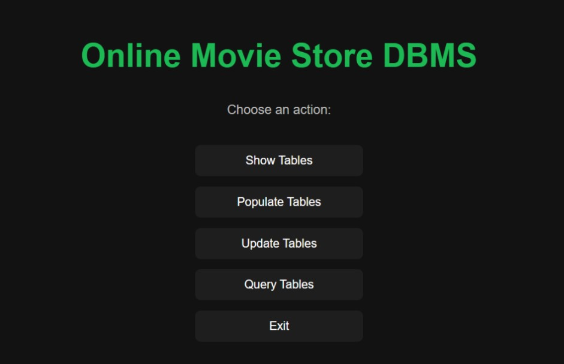
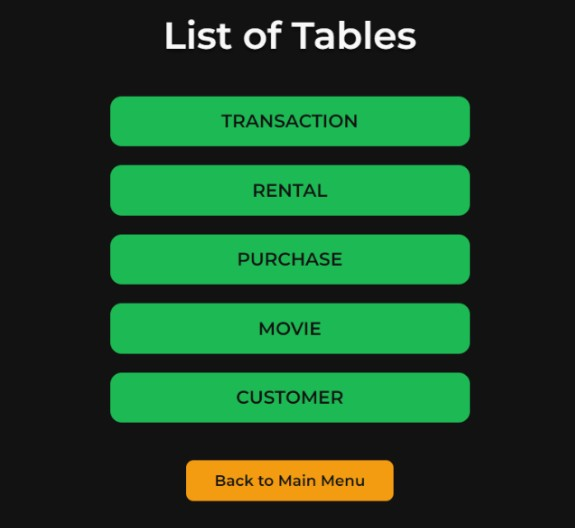
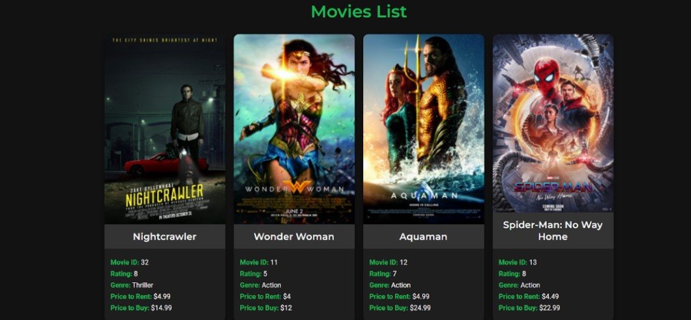
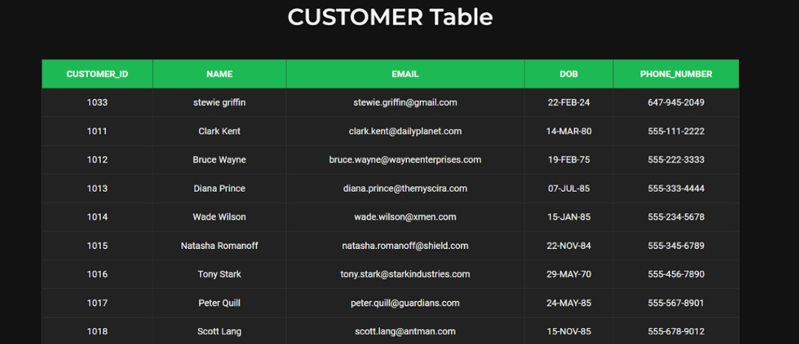
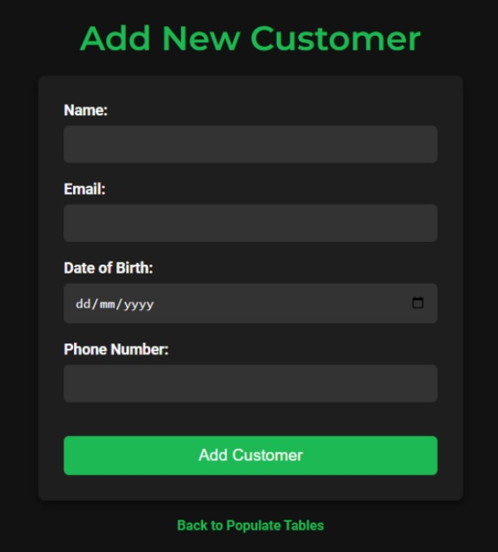

# Online Movie Store DBMS

This project is a Database Management System (DBMS) for an Online Movie Store, built using PHP and MySQL. The system provides a web-based interface that allows users to interact with the database seamlessly. It is designed to simplify the management of movies, customers, and transactions, making it an efficient tool for both administrators and end-users.

**Note**: Access to the website requires a connection to the CS-VPN.

## Features

### 1. Movie Management
- **View Movies**: Browse the entire movie catalog with details like title, genre, release year, and availability.
- **Add Movies**: Insert new movies into the database with all relevant details.
- **Update Movies**: Modify existing movie records, such as changing the genre or updating availability status.
- **Delete Movies**: Remove movies that are no longer available or relevant.

### 2. Customer Management
- **View Customers**: Access a list of registered customers with details like name, email, and membership status.
- **Add Customers**: Register new customers and store their information in the database.
- **Update Customers**: Edit customer details, such as updating contact information or membership status.
- **Delete Customers**: Remove customer records when necessary.

### 3. Transaction Management
- **View Transactions**: Track all transactions, including rental history, payments, and due dates.
- **Add Transactions**: Record new transactions, such as movie rentals or purchases.
- **Update Transactions**: Modify transaction details, such as extending rental periods or updating payment status.
- **Delete Transactions**: Remove outdated or incorrect transaction records.

### 4. User-Friendly Interface
- **Intuitive Navigation**: Easily navigate between different sections (movies, customers, transactions) using the homepage.
- **Search Functionality**: Quickly find specific movies, customers, or transactions using search filters.
- **Responsive Design**: The interface is designed to work seamlessly on both desktop and mobile devices.

### 5. Secure Access
- **Session Management**: Users must log in to access the system, and sessions are securely managed.
- **Logout Functionality**: Users can securely log out, terminating their session and protecting their data.

## Project Description

This project aims to create a web-based DBMS for an Online Movie Store, enabling users to manage the database through a user-friendly interface. The system is built using PHP for server-side scripting and MySQL for database management. Key functionalities include:

- **Frontend-Backend Integration**: PHP connects the web interface with the MySQL database, allowing users to perform CRUD (Create, Read, Update, Delete) operations without writing SQL queries manually.
- **Efficiency**: The system simplifies database management, making it easy for administrators to handle large amounts of data.
- **Scalability**: The modular design allows for future expansion, such as adding new features or integrating with other systems.

## Requirements
- PHP 7.0 or higher
- MySQL Database
- CS-VPN Access (for connectivity to the database)

## Screenshots

Here are some screenshots showcasing the system in action:

### Index Page

The homepage of the Online Movie Store DBMS, offering navigation to other sections.

  

### List Tables Page

This page shows a list of all available tables in the database.

  

### Movies Page

Here, users can browse the catalog of movies available for rental or purchase.

  

### Customers Page

This page displays the list of registered customers and their details.

  

### Add Customer Page

The page for adding new customers to the database with necessary information.

  

## Notes

Ensure the database credentials in `connect.php` are correctly configured before running the application.
